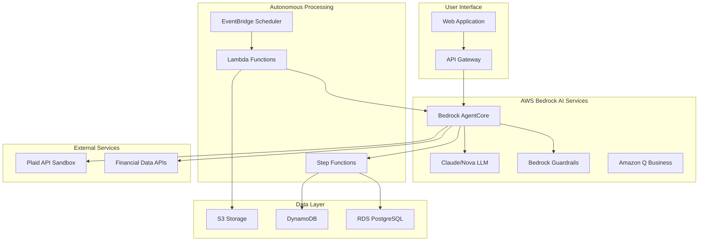

# Design Document

## Overview

The Spending Insights AI Agent is an autonomous financial analysis system that transforms messy spending data into actionable weekly money wins for women and moms. The system leverages AWS Bedrock AgentCore for orchestration, reasoning LLMs for decision-making, and a serverless architecture for scalable, autonomous operation.

The agent operates with minimal human intervention, automatically analyzing financial data, detecting patterns, identifying savings opportunities, and generating personalized weekly insights. It uses chain-of-thought reasoning to make complex financial decisions and integrates with external financial APIs for comprehensive analysis.

## Architecture

### High-Level Architecture



### Core Components

1. **Bedrock AgentCore**: Orchestrates multi-step reasoning workflows and manages tool integration
2. **Reasoning LLM**: Claude 3.5 Sonnet or Nova Pro for complex financial analysis and decision-making
3. **Autonomous Scheduler**: EventBridge + Lambda for weekly analysis triggers
4. **Data Processing Pipeline**: Step Functions for complex data transformation workflows
5. **Security Layer**: Bedrock Guardrails for PII protection and data sanitization

## Components and Interfaces

### 1. AI Agent Orchestration Layer

**Bedrock AgentCore Configuration:**

**AgentCore Primitive Implementation:**

**Primitives Used: Memory Management, Tool Orchestration (Action Groups)**

1. **Memory Management Primitive:**
   - Session context: Last 3 weeks of spending patterns and user interactions
   - User preferences: Category mappings, financial goals, risk tolerance settings
   - Learning data: Manual categorizations, feedback on recommendations, implemented actions
   - Implementation: AgentCore's built-in memory API with DynamoDB backing for persistence
   - Memory structure: Hierarchical context with short-term (session), medium-term (monthly), and long-term (historical) layers

2. **Tool Orchestration Primitive (Action Groups):**
   - Sequential tool calling: analyze → categorize → detect fees → generate recommendations
   - Parallel execution: Multiple category analysis, simultaneous fee detection across accounts
   - Error handling: Tool failure fallbacks, automatic retry logic with exponential backoff
   - Implementation: AgentCore's Action Groups with Lambda function integration
   - Coordination: Smart tool selection based on data type and analysis requirements

3. **Amazon Q Business Integration:**
   - Purpose: "Explain this term" sidebar panel for financial education
   - Knowledge base: Curated financial literacy documents and definitions
   - Implementation: Q Business over curated docs for contextual help
   - Eligibility: Qualifies for Best Amazon Q Application prize category

**Agent Tools:**
- `analyze_spending_patterns`: Analyzes transaction data for trends and anomalies
- `categorize_transactions`: Intelligently categorizes financial transactions
- `detect_fees_and_subscriptions`: Identifies recurring charges and potential waste
- `generate_savings_recommendations`: Creates personalized money-saving suggestions
- `calculate_investment_readiness`: Assesses user's readiness for investment education

### 2. Reasoning and Decision-Making Engine

**Chain-of-Thought Prompting Strategy:**

**Example Autonomous Decision Workflow:**

*Scenario: Detecting unnecessary subscription fees*

Step 1: Pattern Analysis
"I observe a $12.99 charge from 'StreamCo' recurring monthly for 8 months with consistent transaction descriptions."

Step 2: Usage Correlation  
"Cross-referencing with user activity data and spending patterns, I see no complementary entertainment spending or user engagement indicators."

Step 3: Impact Assessment
"Annual cost: $155.88. Cancellation difficulty: Easy (online portal available based on merchant database). User's entertainment budget: $50/month total."

Step 4: Decision
"Priority: HIGH. Recommendation: Cancel StreamCo subscription. Reasoning: High cost relative to budget, low usage indicators, easy cancellation process."

Step 5: Action Generation
"Provide step-by-step cancellation instructions, set up savings tracking for $155.88 annual impact, and suggest alternative lower-cost entertainment options."

**Decision Trees:**
- Savings opportunity prioritization (impact vs. effort matrix)
- Investment readiness assessment (stability vs. goals)  
- Fee elimination urgency (cost vs. cancellation difficulty)

**Explanation and Transparency:**

For demo and evaluation purposes, the agent will:
1. **Generate post-hoc explanations** that summarize the decision rationale without exposing raw reasoning
2. **Display "Why this recommendation?" summaries** showing:
   - Key factors considered (spending patterns, budget impact, ease of implementation)
   - Data points used (e.g., "You spent $156 on this subscription in the last 8 months")
   - Decision outcome (e.g., "High savings potential with easy cancellation")
3. **Log structured decisions** (not raw reasoning) with factors and outcomes for debugging
4. **Internal reasoning remains opaque** - only actionable explanations shown to users
5. **Export decision summaries** as visualizations for architecture documentation

Example explanation structure:
```json
{
  "recommendation_id": "rec-001",
  "explanation": {
    "recommendation": "Cancel StreamCo subscription",
    "key_factors": [
      "Annual cost: $155.88",
      "No recent usage detected in 6 months", 
      "Easy cancellation via online portal"
    ],
    "potential_savings": "$155.88/year",
    "difficulty": "Easy",
    "confidence": "High"
  }
}
```

### 3. Data Processing and Storage

**Data Flow Architecture (Simplified for 2-week build):**
1. **Ingestion**: CSV upload → S3 → Lambda trigger
2. **Processing**: Direct Lambda → Data validation → Categorization
3. **Analysis**: Bedrock Agent → Pattern detection → Insight generation
4. **Storage**: Results → DynamoDB (all data denormalized for fast queries)

### Data Storage (Simplified for MVP)

**Primary Storage:**
- **S3**: CSV uploads, processed data, analysis results, cached API responses
- **DynamoDB**:
  - `user-profiles`: User preferences and financial goals
  - `transactions`: Transaction records with categories (denormalized)
  - `weekly-insights`: Generated insights and recommendations
  - `agent-memory`: Conversation context and learning data
  - `savings-tracking`: Progress tracking for implemented recommendations

**Removed from MVP:**
- ~~RDS PostgreSQL~~ (added complexity, use DynamoDB instead)
- ~~Step Functions~~ (use direct Lambda orchestration initially)

### 4. External API Integration

**External API Integration (Demo-focused):**

1. **Plaid Sandbox API** (Limited for demo)
   - Primary demo: Use pre-loaded test data and CSV upload
   - Endpoints: `/transactions/get`, `/accounts/get` (cached responses)
   - Purpose: Demonstrate external API integration capability
   - Demo strategy: Show 1-2 cached API calls during presentation

2. **Alpha Vantage API** (Cached responses)
   - Purpose: Market data for investment education context
   - Demo strategy: Cache 2-3 responses, limit to 5 calls total during development
   - Use case: Educational examples for investment readiness assessment
   - Cost control: Pre-fetch data during development, serve from S3 during demo

3. **Merchant Category Database (Custom DynamoDB)**
   - Purpose: Fee comparison database and merchant categorization rules
   - Data sources: Curated dataset of common merchants and fee patterns
   - Shared across user base for pattern learning and fee detection
   - Implementation: Static dataset loaded into DynamoDB

4. **Federal Reserve Economic Data (FRED) API** (Optional)
   - Purpose: Economic context for investment education (cached data)
   - Demo strategy: Use cached data for educational content
   - Cost control: Maximum 10 API calls during development phase

### 5. Autonomous Operation System

**Autonomous Workflows (No Human Intervention):**

1. **Weekly Analysis Trigger:**
   - Sunday 6 AM: EventBridge triggers `weekly-insights-generator`
   - Agent autonomously: Retrieves week's transactions → Analyzes patterns → Detects anomalies → Generates 3+ recommendations → Calculates savings → Stores insights → Sends notification
   - Human intervention: Zero (unless critical error requiring manual review)

2. **Real-Time Fee Detection:**
   - Transaction ingestion triggers `fee-detector` Lambda
   - Agent autonomously: Checks transaction against fee patterns → Calculates annual impact → Assesses urgency → Flags for immediate alert → Queues cancellation guidance
   - Human intervention: Only for confirmation/action on recommendations

3. **Self-Learning Categorization:**
   - When user manually categorizes a transaction
   - Agent autonomously: Updates category mapping → Identifies similar past transactions → Recategorizes historical data → Improves future predictions
   - Human intervention: Initial categorization only

**EventBridge Scheduler:**
- Weekly analysis triggers (every Sunday at 6 AM)
- Monthly deep analysis (first Sunday of month)
- Real-time fee alert processing

**Lambda Functions (Streamlined):**
- `transaction-processor`: Handles CSV ingestion, categorization, and fee detection
- `weekly-insights-generator`: Orchestrates autonomous weekly analysis and recommendations
- `api-handler`: REST API endpoints for UI interactions and user management

## Data Models

### Core Data Structures

```typescript
interface Transaction {
  id: string;
  userId: string;
  amount: number;
  description: string;
  category: string;
  subcategory?: string;
  date: Date;
  account: string;
  isRecurring: boolean;
  confidence: number; // AI categorization confidence
}

interface WeeklyInsight {
  id: string;
  userId: string;
  weekOf: Date;
  totalSpent: number;
  topCategories: CategorySpending[];
  recommendations: Recommendation[];
  potentialSavings: number;
  implementedActions: string[];
  generatedAt: Date;
}

interface Recommendation {
  id: string;
  type: 'save' | 'invest' | 'eliminate_fee' | 'optimize';
  title: string;
  description: string;
  potentialSavings: number;
  difficulty: 'easy' | 'medium' | 'hard';
  priority: number;
  actionSteps: string[];
  reasoning: string; // AI's chain-of-thought explanation
}

interface AgentMemory {
  userId: string;
  conversationHistory: ConversationTurn[];
  learnedPreferences: UserPreference[];
  categoryMappings: CategoryMapping[];
  lastAnalysisDate: Date;
}
```

### Data Validation and Security

**Input Validation:**
- CSV format validation with schema enforcement
- Transaction amount bounds checking
- Date range validation
- PII detection and redaction via Bedrock Guardrails

**Data Sanitization:**
- Remove or mask account numbers
- Redact sensitive merchant information
- Normalize transaction descriptions

**Financial Advice Protection:**

1. **Bedrock Guardrails Policy:**
   - Block prescriptive investment recommendations ("you should invest in X")
   - Require "educational only" framing for all investment content
   - Detect and flag specific stock/fund recommendations
   - Prevent definitive financial advice language

2. **UI Disclaimers:**
   - Every recommendation page: "This is educational information, not financial advice"
   - Investment section: "Consult a licensed financial advisor before investing"
   - Clear separation between savings tips (actionable) and investment education (informational)

3. **Response Templates:**
   - "Based on your savings patterns, you might explore learning about..." (not "you should invest in...")
   - "Common investment options include..." (not "I recommend...")
   - "Consider researching..." (not "You should buy...")

## Error Handling

### Error Categories and Responses

**1. Data Processing Errors:**
- Invalid CSV format → User-friendly error with format guide
- Missing required fields → Specific field validation messages
- Data corruption → Automatic retry with fallback processing

**2. AI Agent Errors:**
- LLM timeout → Graceful degradation with cached insights
- Reasoning chain failure → Simplified analysis with manual review flag
- Tool integration failure → Alternative analysis path

**3. External API Errors:**
- Plaid API unavailable → Use cached data with staleness indicator
- Rate limiting → Implement exponential backoff with user notification
- Authentication failure → Clear re-authentication flow

**4. System Errors:**
- Database unavailable → Queue operations for retry
- Lambda timeout → Break into smaller processing chunks
- Memory limits → Implement data pagination

### Error Recovery Strategies

**Autonomous Recovery:**
- Automatic retry with exponential backoff
- Fallback to simpler analysis methods
- Cached result serving during outages

**User Communication:**
- Clear, non-technical error messages
- Suggested actions for user-resolvable issues
- Progress indicators during recovery

## Testing Strategy

### 1. Unit Testing

**AI Agent Components:**
- Tool function testing with mock data
- Reasoning chain validation
- Memory management verification
- Decision tree accuracy testing

**Data Processing:**
- CSV parsing edge cases
- Transaction categorization accuracy
- Fee detection precision
- Savings calculation validation

### 2. Integration Testing

**AWS Services Integration:**
- Bedrock AgentCore orchestration flows
- EventBridge → Lambda trigger chains
- Step Functions workflow execution
- Database read/write operations

**External API Integration:**
- Plaid sandbox connection testing
- API error handling scenarios
- Rate limiting behavior
- Data transformation accuracy

### 3. End-to-End Testing

**User Journey Testing:**
- Complete CSV upload → insights generation flow
- Weekly autonomous analysis execution
- Recommendation implementation tracking
- Multi-week progress validation

**Autonomous Agent Testing:**
- Unattended operation for 1+ weeks
- Decision-making consistency
- Error recovery without human intervention
- Performance under various data loads

### 4. Performance Testing

**Scalability Testing:**
- Multiple concurrent users
- Large transaction datasets (10k+ transactions)
- Peak load during weekly analysis windows
- Memory usage optimization

**Latency Testing:**
- Real-time categorization response times
- Insight generation speed
- API response times
- Database query optimization

### 5. Security Testing

**Data Protection:**
- PII redaction effectiveness
- Encryption in transit and at rest
- Access control validation
- Audit trail completeness

**AI Safety Testing:**
- Guardrails effectiveness
- Inappropriate recommendation detection
- Financial advice disclaimer compliance
- Bias detection in recommendations

### 6. Demo and Hackathon Testing

**Demo Scenario Testing:**
- 3-minute demo flow rehearsal
- End-to-end agentic workflow demonstration
- Error-free operation during presentation
- Clear value proposition showcase

**Submission Validation:**
- All AWS services integration verification
- Architecture diagram accuracy
- Code repository completeness
- Deployment process validation
##
 Deployment and Submission

### Deployment Architecture
- **AWS Region**: us-east-1 (all required services available)
- **Deployment Method**: AWS CDK for infrastructure as code
- **CI/CD**: GitHub Actions for automated deployment and testing
- **Environment Management**: Separate dev, staging, and production environments

### Submission Deliverables (Requirement 8)

1. **Public GitHub Repository**
   - Source code with clear folder structure following project conventions
   - README with comprehensive setup instructions and prerequisites
   - AWS CDK deployment scripts with parameter configuration
   - Sample CSV data for testing and demonstration
   - Environment configuration templates

2. **Architecture Diagram**
   - High-level system architecture (included above)
   - Detailed AWS services interaction diagram
   - Data flow diagrams showing autonomous agent workflows
   - Security and compliance architecture views

3. **Text Description**
   - Solution overview and value proposition for target users
   - Technical architecture summary highlighting AWS AI services
   - Key innovations: autonomous operation, reasoning transparency, real-time insights
   - Differentiators: educational approach, women-focused UX, hackathon compliance

4. **3-Minute Demo Video Structure**
   - 0:00-0:30: Problem statement - women/moms need weekly money wins from messy spending data
   - 0:30-1:30: End-to-end flow - Upload CSV → agent calls tools (show AgentCore Action Groups screenshot) → insights appear → "Why this?" explanation cards
   - 1:30-2:15: Autonomy & security - EventBridge logs + "Last autonomous run" badge; Guardrails policy and PII redaction example
   - 2:15-3:00: Impact - "Savings this month" display, fee alert with annualized impact, mention cost controls and teardown process

5. **Deployed Project URL**
   - Live web application: `https://spending-insights-demo.aws.example.com`
   - API endpoint: `https://api.spending-insights-demo.aws.example.com`
   - Demo credentials and sample data provided for judges
   - Health check endpoints for system status verification

**Cost Controls and Credit Management:**

1. **Resource Limits:**
   - Lambda: 512MB memory, 30s timeout (not 15min for cost control)
   - Bedrock: Use Claude 3 Haiku for categorization (cheaper), Sonnet only for insights
   - API calls: Cache Alpha Vantage (5 calls max), FRED (10 calls max)
   - DynamoDB: On-demand pricing with budget alerts at $50

2. **Development Strategy:**
   - Week 1: Core functionality with mocked data (minimal AWS costs <$10)
   - Week 2: AWS integration and testing (use credits, target <$40)
   - Demo day: Pre-loaded data, cached API responses

3. **Teardown Process:**
   - CDK destroy script included in repo
   - Budget alarm at $75 (before $100 credit limit)
   - Auto-shutdown for demo environment after judging period

**AgentCore Primitive Documentation:**

For evaluation, the submission will include:

1. **Primitive Usage Documentation:**
   - **Memory Management Primitive**: Code showing session context persistence in DynamoDB
   - **Action Groups / Tool Orchestration Primitive**: Configuration showing 5 tool definitions

2. **Tool Call Trace Example (for demo video):**
   ```
   User uploads CSV → Agent invokes tools:
   1. analyze_spending_patterns(transactions) → patterns detected
   2. categorize_transactions(uncategorized) → categories assigned  
   3. detect_fees_and_subscriptions(patterns) → 2 fees found
   4. generate_savings_recommendations(patterns, fees) → 3 recommendations
   5. Memory updated with user preferences
   ```

3. **Screenshots in Demo:**
   - CloudWatch logs showing tool invocations
   - AgentCore console showing configured action groups
   - "Last autonomous run" UI badge showing timestamp and insights count
   - Bedrock Guardrails policy JSON for PII redaction and investment disclaimers

4. **Reproducibility Requirements:**
   - README includes `make deploy` (CDK bootstrap if needed) and `make destroy` commands
   - One-liner deployment for judges: `git clone → make deploy → access URL`
   - Guardrails policy JSON included in repo for reviewer inspection

### Regional Compliance
- All services deployed in us-east-1 for maximum service availability
- Data residency and compliance considerations documented
- GDPR and financial data protection measures implemented via Bedrock Guardrails