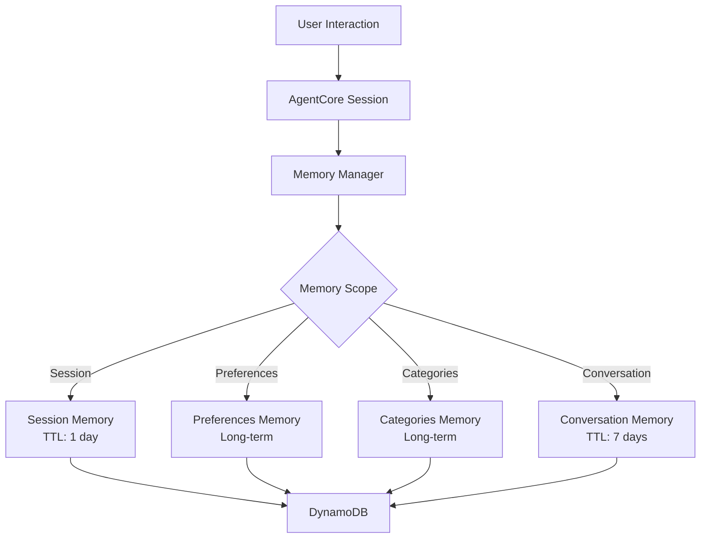
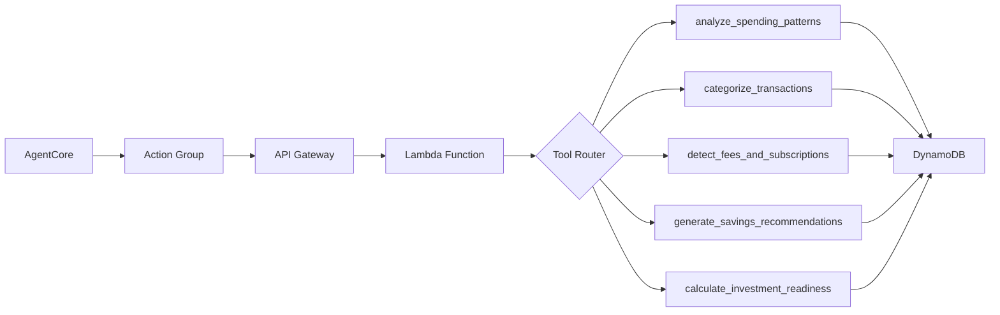

# AgentCore Setup and Configuration

This document provides detailed instructions for setting up and configuring AWS Bedrock AgentCore for the Spending Insights AI Agent.

## Overview

The Spending Insights AI Agent uses AWS Bedrock AgentCore with the following primitives:

1. **Memory Management Primitive**: Session context persistence in DynamoDB
2. **Tool Orchestration Primitive (Action Groups)**: 5 financial analysis tools

## Prerequisites

### 1. AWS Account Setup

- AWS account with appropriate permissions
- Bedrock model access approved for:
  - `anthropic.claude-3-5-sonnet-20241022-v2:0`
  - `anthropic.claude-3-haiku-20240307-v1:0`
  - `amazon.nova-lite-v1:0` (optional)
  - `amazon.nova-pro-v1:0` (optional)

### 2. Environment Variables

Set the following environment variables:

```bash
export AWS_REGION=us-east-1
export AWS_ACCOUNT_ID=<your-account-id>
export DATA_BUCKET=<your-s3-bucket-name>
export API_HANDLER_LAMBDA_ARN=<lambda-arn>
export BEDROCK_AGENT_ROLE_ARN=<iam-role-arn>
```

### 3. Infrastructure Deployment

Ensure the CDK stack is deployed:

```bash
make deploy
```

## AgentCore Configuration

### Step 1: Upload Action Group Schema

Upload the OpenAPI schema to S3:

```bash
make upload-schema
```

This uploads `infra/agent/action-group-schema.json` to S3 for Bedrock Agent configuration.

### Step 2: Register Bedrock Agent

Create and configure the Bedrock Agent:

```bash
make register-agent
```

This script:
- Creates a new Bedrock Agent or updates existing one
- Configures memory management with SESSION_SUMMARY
- Creates Action Group with 5 financial analysis tools
- Prepares the agent for use
- Creates a production alias

### Step 3: Test Memory Management

Verify memory management functionality:

```bash
make test-memory
```

This tests:
- Session initialization
- Memory storage and retrieval
- Tool execution recording
- Cross-session persistence
- Memory scope management

## Memory Management Architecture

### Memory Scopes

The agent uses hierarchical memory scopes:

1. **Session Memory** (TTL: 1 day)
   - Current session context
   - Temporary conversation state
   - Active tool executions

2. **Preferences Memory** (Long-term)
   - User preferences and settings
   - Learning from user corrections
   - Notification preferences

3. **Categories Memory** (Long-term)
   - Category mapping patterns
   - Learned categorization rules
   - User-corrected categories

4. **Conversation Memory** (TTL: 7 days)
   - Recent conversation history
   - Tool execution traces
   - Context for follow-up questions

5. **Analysis Memory** (Long-term)
   - Last analysis timestamps
   - Historical insights
   - Progress tracking

### Memory Persistence

Memory is persisted in DynamoDB with the following structure:

```
Table: spending-insights-agent-memory
PK: USER#<userId>
SK: SCOPE#<scope>
```

Example records:
- `USER#user123` / `SCOPE#session` - Session memory
- `USER#user123` / `SCOPE#preferences` - User preferences
- `USER#user123` / `SCOPE#categories` - Category mappings

## Tool Orchestration (Action Groups)

### Available Tools

The agent has access to 5 financial analysis tools:

1. **analyze_spending_patterns**
   - Analyzes transaction data for trends and anomalies
   - Input: userId, timeframe, optional category filter
   - Output: Spending patterns, trends, insights

2. **categorize_transactions**
   - Intelligently categorizes financial transactions
   - Input: Array of transaction objects
   - Output: Categorized transactions with confidence scores

3. **detect_fees_and_subscriptions**
   - Detects recurring charges and unnecessary fees
   - Input: userId, transaction array
   - Output: Detected fees with annual cost impact

4. **generate_savings_recommendations**
   - Creates personalized money-saving suggestions
   - Input: userId, spending patterns, detected fees
   - Output: Prioritized recommendations with action steps

5. **calculate_investment_readiness**
   - Assesses financial stability for investment education
   - Input: userId, financial data (income, expenses, debts)
   - Output: Readiness score and educational recommendations

### Tool Endpoints

All tools are accessible via REST API endpoints:

```
POST /tools/analyze-spending-patterns
POST /tools/categorize-transactions
POST /tools/detect-fees-and-subscriptions
POST /tools/generate-savings-recommendations
POST /tools/calculate-investment-readiness
```

### Tool Orchestration Flow

The agent orchestrates tools in logical sequences:

1. **Data Analysis Flow**:
   ```
   analyze_spending_patterns → categorize_transactions → detect_fees_and_subscriptions → generate_savings_recommendations
   ```

2. **Investment Assessment Flow**:
   ```
   analyze_spending_patterns → calculate_investment_readiness
   ```

## Testing and Validation

### Memory Management Tests

Run comprehensive memory tests:

```bash
make test-memory
```

Expected output:
```
✅ Session initialization
✅ Memory storage and retrieval
✅ Tool execution recording
✅ Memory summary generation
✅ User preference learning
✅ Cross-session persistence
✅ Memory scope management
✅ Memory cleanup
```

### Tool Integration Tests

Test individual tools via API:

```bash
# Test spending analysis
curl -X POST https://your-api-gateway/tools/analyze-spending-patterns \
  -H "Content-Type: application/json" \
  -d '{"userId":"test-user","timeframe":"month"}'

# Test transaction categorization
curl -X POST https://your-api-gateway/tools/categorize-transactions \
  -H "Content-Type: application/json" \
  -d '{"transactions":[{"id":"tx1","description":"Grocery Store","amount":45.67,"date":"2024-01-15"}]}'
```

### End-to-End Agent Testing

Test the complete agent workflow in the Bedrock console:

1. Navigate to AWS Bedrock Console
2. Select "Agents" from the left menu
3. Find "spending-insights-ai-agent"
4. Click "Test" to open the chat interface
5. Test with sample prompts:

```
"Analyze my spending patterns for the last month"
"Help me categorize these transactions: [transaction data]"
"What fees can I eliminate to save money?"
"Generate savings recommendations based on my spending"
"Am I ready to learn about investing?"
```

## Troubleshooting

### Common Issues

1. **Agent Creation Fails**
   - Verify Bedrock model access is approved
   - Check IAM permissions for Bedrock Agent operations
   - Ensure Lambda function exists and is accessible

2. **Memory Tests Fail**
   - Verify DynamoDB tables are deployed
   - Check AWS credentials configuration
   - Ensure environment variables are set correctly

3. **Tool Calls Fail**
   - Verify API Gateway endpoints are accessible
   - Check Lambda function logs in CloudWatch
   - Ensure Action Group schema is uploaded to S3

4. **Permission Errors**
   - Verify Bedrock Agent IAM role has necessary permissions
   - Check Lambda execution role permissions
   - Ensure cross-service permissions are configured

### Debug Commands

```bash
# Check CDK deployment status
make list

# Validate database connectivity
make validate-db

# Check Lambda function logs
aws logs tail /aws/lambda/spending-insights-api-handler --follow

# Test DynamoDB operations
make test-db-integration
```

## Architecture Diagrams

### Memory Management Flow



### Tool Orchestration Flow



## Production Considerations

### Security

- All PII is redacted using Bedrock Guardrails
- Financial advice disclaimers are enforced
- IAM roles follow least-privilege principle
- Memory data is encrypted at rest in DynamoDB

### Performance

- Memory operations are optimized for sub-200ms response times
- Tool executions are logged for performance monitoring
- DynamoDB uses on-demand billing for cost optimization
- Lambda functions have 25-second timeout for API Gateway compatibility

### Monitoring

- CloudWatch logs capture all agent interactions
- X-Ray tracing enabled for API handler Lambda
- Memory usage metrics tracked per user
- Tool execution times monitored for optimization

### Cost Control

- Session memory has TTL to prevent unbounded growth
- Conversation memory limited to last 50 turns
- DynamoDB uses on-demand pricing with budget alerts
- Lambda memory optimized at 512MB for cost/performance balance

## Next Steps

After successful AgentCore setup:

1. **Deploy to Production**: Create production alias and test thoroughly
2. **Monitor Performance**: Set up CloudWatch dashboards and alerts
3. **Optimize Memory**: Fine-tune TTL values based on usage patterns
4. **Enhance Tools**: Add more sophisticated AI models for better accuracy
5. **Scale Testing**: Test with multiple concurrent users and larger datasets